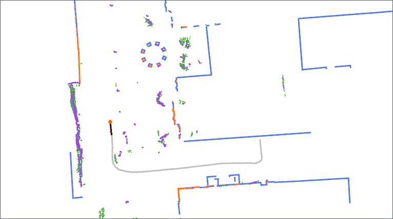

# vector_display


## Dependencies

1. [glog](https://github.com/google/glog)
1. [gflags](https://github.com/gflags/gflags)
1. [Lua5.1](http://www.lua.org/)
1. [Qt5](https://www.qt.io/)
1. [ROS](https://www.ros.org/)

You can install the dependencies except for ROS on *buntu using:
```
sudo apt install libgoogle-glog-dev libgflags-dev liblua5.1-0-dev qt5-default
```

For installation instructions for ROS, please consult the [ROS Installation Wiki](http://wiki.ros.org/Installation/Ubuntu)

## Build

1. Add the project directory to `ROS_PACKAGE_PATH`:
    ```
    export ROS_PACKAGE_PATH=MYDIRECTORY:$ROS_PACKAGE_PATH
    ```
    (Replace `MYDIRECTORY` with the actual directory)
    You can also add this to your `~/.bashrc` file so that you don't have to do
    this every time you open a new terminal.
1. Build the program:
    ```
    make
    ```
    Optionally, to compile on all cores (make sure you have sufficient RAM!)
    ```
    make -j
    ```
1. Do **not** run `cmake`, `catkin_make`, `rosbuild`.


## Run

Run `./bin/vector_display`

## Example



An example ROS bag recording of visualizations published by Episodic non-Markov Localization:
https://drive.google.com/file/d/1xFRnl43OD2SQKTVB_t0nEv_48WumtSWT/view?usp=sharing
